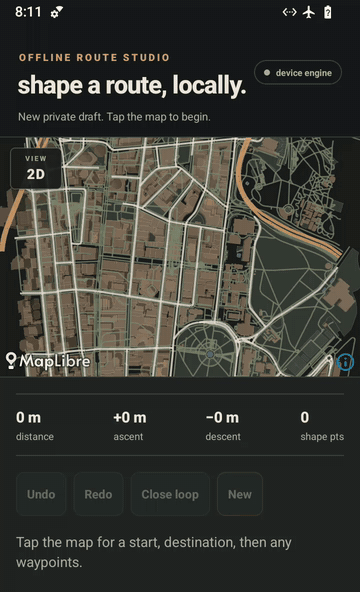

# Offline Routing Demo

An Android map that still boots and routes in airplane mode, backed by a real
on-device Rust CCH engine. When connectivity returns, the same route can be
published to a bounded Worker/D1 API and inspected in a browser.



The 15-second capture above comes from the final release APK on the named
Android 14 emulator with airplane mode enabled. A still and the device gate log
are retained under [`docs/evidence`](docs/evidence/).

The repository is a new, self-contained portfolio monorepo. It has no account,
location permission, hosted basemap, routing endpoint, private infrastructure,
or inherited product history.

## Try the complete flow

Current delivery status: the fixture, native engine, Android release build,
airplane-mode device proof, API contract, and viewer are verified locally.
Public API, viewer, and GitHub Release URLs will appear here only after their
external smoke tests pass.

| Experience | Link | Status |
| --- | --- | --- |
| Android APK | pending GitHub Release | local release verified |
| Browser viewer | pending public URL | local WebGL E2E verified |
| Segment API | pending Worker URL | local D1 integration verified |

Playwright reference captures are kept for the
[desktop viewer](apps/viewer/e2e/viewer-desktop.spec.ts-snapshots/viewer-desktop-desktop-chromium-linux.png)
and its [mobile layout](apps/viewer/e2e/viewer-mobile.spec.ts-snapshots/viewer-mobile-mobile-chromium-linux.png).

The intended user journey is deliberately small:

1. install the APK;
2. enable airplane mode and cold-start the app;
3. tap an origin and destination—the route is computed and drawn locally;
4. reconnect and publish the geometry;
5. open the viewer and find the same public segment.

## What this demonstrates

- deterministic fixture production from a pinned public OpenStreetMap snapshot;
- real CCH preprocessing, customization, bidirectional upward query, and
  recursive shortcut unpacking in Rust;
- a narrow Rust C ABI and Nitro/C++ bridge with tested buffer ownership and
  panic barriers;
- embedded MapLibre/PMTiles rendering through a loopback-only range server;
- a versioned relational model, parameterized D1 queries, bounded z14 spatial
  cells, idempotency, TTL, privacy controls, and fail-closed edge rate limiting;
- a static MapLibre GL JS viewer with real PMTiles WebGL E2E coverage;
- TDD, property tests, integration tests, named-device evidence, coverage gates,
  dependency review, secret scanning, and public-boundary auditing.

## Architecture

```text
pinned Sydney OSM snapshot
        │
        ├── deterministic builder ──> PMTiles + style + manifest
        └── graph builder ──> CCHP1 pack
                                  │
tap A/B ─> React Native ─> Nitro ─> C++ ─> Rust CCH query/unpack
   │            │                               │
   │            └──── MapLibre <── loopback PMTiles server
   │
   └── explicit online action ─> Worker API ─> D1 segments + z14 cells
                                      ^                    │
                                      └── browser viewer <─┘
```

Everything above the explicit online action is packaged in the APK. The map
style points only to `127.0.0.1`; the route screen does not import the network
client. `POST /segments` and `GET /segments` are user-triggered actions and are
disabled when no public API URL was injected at build time.

The online model stores encoded geometry plus server-derived distance, point
count, bbox, timestamps, and z14 cells. Anonymous uploads expire after 24 hours;
the public seed is permanent. Reads search `segment_cells` first, then apply an
exact bbox filter. The query plan is recorded in
[docs/api-explain.md](docs/api-explain.md).

Detailed boundaries live in [architecture](docs/architecture.md) and the
[architecture decisions](docs/adr/).

## Workspace

| Path | Responsibility |
| --- | --- |
| `fixtures/sydney` | attributed public inputs and deterministic runtime assets |
| `crates/cch-routing-lite` | CCH pack build/load/query/unpack |
| `crates/cch-routing-lite-ffi` | ownership-safe C ABI |
| `crates/tile-server-lite` | loopback-only PMTiles/style HTTP server |
| `packages/offline-router` | Nitro/C++ mobile bridge |
| `packages/shared` | geometry, polyline6, bbox, and z14 contracts |
| `apps/mobile` | Expo 54 / React Native 0.81 / MapLibre Android app |
| `apps/api` | Cloudflare Worker and versioned D1 migrations |
| `apps/viewer` | React/Vite/MapLibre GL JS install-free viewer |

## Reproduce it

Prerequisites are Node `22.23.2` (see `.node-version`), pnpm `10.24.0`, a stable
Rust toolchain, and `cargo-llvm-cov` `0.9.0` for the full coverage gate.

```bash
pnpm install --frozen-lockfile

# Rebuild and compare every public fixture artifact byte-for-byte.
make fixture
make verify-fixture

# Static analysis, builds, tests, coverage, cleanup, and public audit.
make verify-local
```

`make fixture` requires no network after checkout. The current `CCHP1` routing
pack is 1,124,780 bytes with SHA-256:

```text
f76d7fb4f9323db1eeb2f6cebe575c8ca3fda94c04e07d45b434f8adb6907088
```

The manifest pins provenance, byte sizes, checksums, the Sydney bbox, and a
5 MB fixture budget in
[`fixtures/sydney/manifest.json`](fixtures/sydney/manifest.json).

### Android release

Android additionally requires SDK 36, NDK 27.1, CMake, an x86_64 or arm64
device, and `ANDROID_SERIAL`.

```bash
./scripts/build-apk.sh

# With airplane mode already enabled on the named target:
ANDROID_SERIAL=localhost:5555 \
  ./scripts/device/verify-release.sh \
  "$HOME/.offline-routing-demo/releases/offline-routing-demo-cchp1.apk"
```

The build creates a demo keystore under the user's home directory and writes
the APK outside the repository. No signing material is versioned. The device
gate inspects final APK permissions, installs it, verifies native startup,
exercises Android back handling, and runs a local route while airplane mode is
on. The latest clean-clone build proof records the
[device result](docs/evidence/2026-08-31T12-38-00Z-release-device.txt) and
[airplane-mode screen](docs/evidence/2026-08-31T12-38-00Z-release-device.png).

### API and viewer development

```bash
# Real local D1 migrations and query-plan evidence.
pnpm --filter @offline-routing/api d1:migrate:local
pnpm --filter @offline-routing/api d1:explain:local

# Static viewer at http://127.0.0.1:4173.
VITE_API_BASE_URL=http://127.0.0.1:8787 \
  pnpm --filter @offline-routing/viewer dev
```

The viewer's API origin is fixed by `VITE_API_BASE_URL` at build time. A public
URL query parameter cannot redirect browser requests to another origin.

Production deployment is intentionally explicit. The API workflow refuses the
placeholder D1 identifier and any non-public `VIEWER_ORIGIN`, validates and writes
`RATE_LIMIT_SALT` to a mode-0600 ephemeral file before any remote mutation, applies
versioned migrations non-interactively, then creates or updates the Worker with
that secret in the same deploy command. GitHub receives three
secrets (`CLOUDFLARE_API_TOKEN`, `CLOUDFLARE_ACCOUNT_ID`, `RATE_LIMIT_SALT`);
none enters Git or command output. Pages builds the viewer with the repository
variable `SEGMENTS_API_URL`.
After deployment, the state-changing contract smoke test is:

```bash
pnpm verify:live-api -- --url https://<worker-origin>
```

It accepts only the public HTTPS `*.workers.dev` origin produced by this deployment,
bounds DNS resolution and rejects non-public answers, publishes one bounded Sydney
segment, and requires the same record to be returned by the bbox query. It prints
statuses, never request bodies, credentials, URLs, or idempotency keys.

## Performance evidence

The benchmark traverses the production Nitro/C++/Rust route path with a fixed
1,024-query corpus. It records failures and separates pack loading from warm
queries.

Device: `redroid14_x86_64 (AX102)`, Android 14, x86_64 emulator, airplane mode.

| Measurement | Result |
| --- | ---: |
| successful warm queries | 1,024 / 1,024 in every run |
| median of 20 per-run p50 values | 1,108 µs |
| median of 20 per-run p95 values | 1,481 µs |
| median cold pack load | 98,734 µs |
| cold pack load range | 95,134–111,614 µs |

Raw JSON/log pairs and the method are under [docs/benchmarks](docs/benchmarks/)
and [ADR 0006](docs/adr/0006-device-benchmark.md). These numbers characterize
the named emulator, not every Android phone.

## Test and security posture

Tests were introduced RED before their corresponding implementation. The suite
contains unit, property, ABI ownership, fixture-to-route, real local D1,
Playwright WebGL, and Android release/device gates. Thresholds are enforced per
workspace and globally; focused, skipped, todo, and ignored tests are rejected.
See [docs/testing.md](docs/testing.md) for the current matrix and commands.

`make audit-public` checks the working tree and reachable Git history for
unexpected remotes, sensitive vocabulary, endpoints, environment files,
credentials, native build artifacts, and license gaps. CI also runs gitleaks.
The dependency gate rejects critical/high findings except two exact unpatched
Expo/Metro build-time parser advisories whose path and threat boundary are
locked and documented in
[public readiness](docs/security/public-readiness.md).

## Limits, by design

- The fixture covers a compact Sydney CBD bbox; this is not a global router.
- The basemap is intentionally sparse and label-free to keep provenance and
  reproducibility obvious.
- The emulator benchmark is retained honestly until a separate physical arm64
  report is added.
- Anonymous geometry can still be identifying. The API accepts no account or
  free text, rounds public timestamps to the minute, stores no IP/User-Agent,
  and expires user rows after 24 hours.
- CORS is a browser boundary, not authentication. Edge rate limiting is the
  abuse control for both reads and writes.

## License and data

Code is dual-licensed MIT or Apache-2.0. The Sydney fixture is derived from
OpenStreetMap data under ODbL 1.0; attribution and source provenance are in
[NOTICE.md](NOTICE.md), [docs/data-sources.md](docs/data-sources.md), and beside
the fixture itself.
