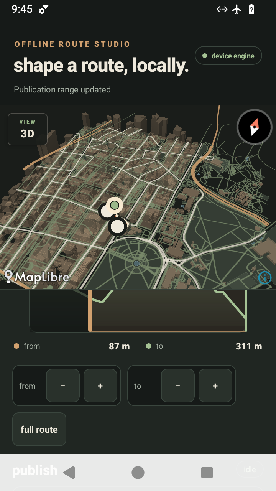

# Android elevation-cut device proof

- device: `redroid14_x86_64`
- Android: 14
- build: signed release APK from `./scripts/build-apk.sh`
- mode: airplane mode enabled
- routing result: `local_native`, with no routing-network fallback
- release APK SHA-256: `9c36b0e52e6c83cdb12e4100f064eccecf4462f460e36332cf6193296d104a8f`

The release gate installed and launched the rebuilt APK successfully. A direct
ADB drag on the shared React Native start handle then changed its exposed value
from `0 m` to `87 m`; the end handle remained at `311 m`. The start-handle
bounds were 88 physical pixels wide on this 2x-density device, which is the
specified 44 dp touch target.

This smoke specifically caught and closed an earlier implementation problem:
a `Pressable` wrapper consumed the pan responder. The final release uses an
accessible `View` as the direct gesture target and was rebuilt before this
proof was recorded.

