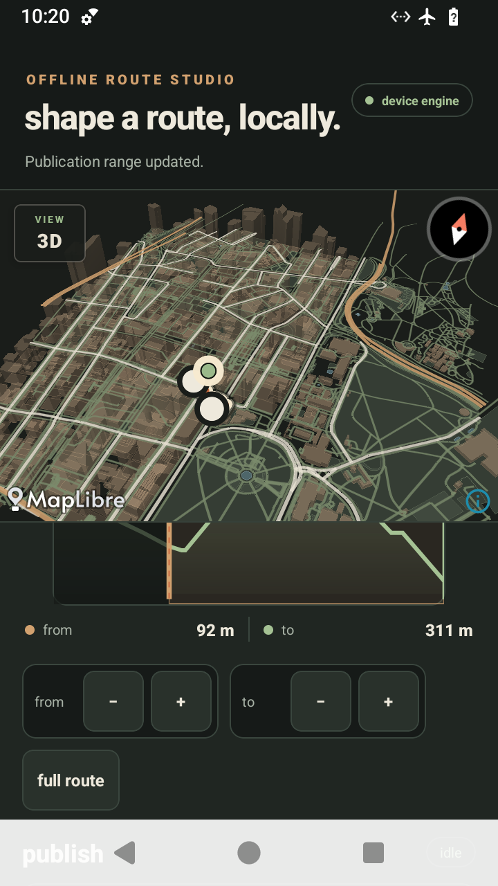

# Android elevation-cut final device proof

- device: `redroid14_x86_64`
- Android: 14
- mode: airplane mode enabled
- release build: `./scripts/build-apk.sh`, arm64-v8a + x86_64
- routing result: `local_native`, with no routing-network fallback
- APK SHA-256: `8eab7a13155e7c8fb28a39188ff48b23e78c509047c171c16f8901b34a14b9ee`

The release gate installed and launched the clean-built APK. A direct ADB drag
on the shared React Native start handle changed its exposed value from `0 m` to
`92 m`; the end handle remained at `311 m`. The handle bounds were 88 physical
pixels wide on this 2x-density device, matching the specified 44 dp touch target.

The captured screen shows the continuous SVG profile, excluded range, direct
start/end bounds, synchronized distance readout, fine controls, and the route on
the offline 3D map.

